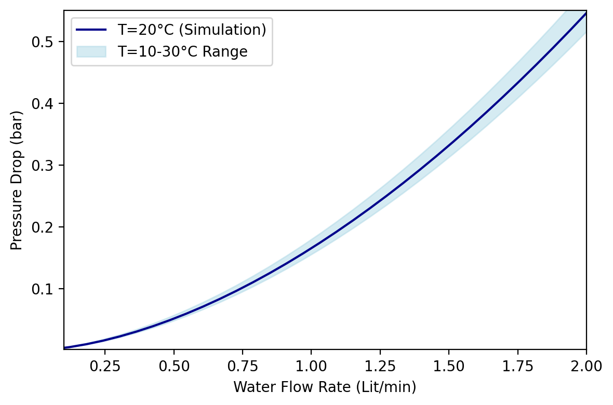

# Flow Rate, Pressure Drop, and Temperature Rise

This repository contains code for simulating and visualizing the relationship between flow rate, pressure drop, and temperature rise in a straight pipe with a circular cross-section. The simulations are based on fundamental principles, including the Darcy–Weisbach equation, Colebrook equation, and Moody diagram.

## Overview

The simulations in this repository explore the behavior of fluid flow and heat transfer in a straight pipe. Specifically, two aspects are covered:

1. Flow Rate and Pressure Drop: The simulation investigates how flow rate and pressure drop are related in a pipe. It utilizes principles from fluid dynamics, including the Darcy–Weisbach equation and the Colebrook equation.

2. Flow Rate and Temperature Rise: The code analyzes how the flow rate affects the temperature rise in a current-carrying coil inside the pipe. This is particularly relevant for applications involving heat transfer.

## Key References

Before diving into the code and simulations, it's important to be aware of the following key references and concepts:

- [Darcy–Weisbach Equation](https://en.wikipedia.org/wiki/Darcy%E2%80%93Weisbach_equation): This equation is fundamental for calculating pressure drop in a pipe.

- [Colebrook Equation](https://en.wikipedia.org/wiki/Darcy%E2%80%93Weisbach_equation#Colebrook_equation): The Colebrook equation is used to solve for the friction factor in the Darcy–Weisbach equation. It often requires iterative methods like the Newton-Raphson method.

- [Moody Diagram](https://en.wikipedia.org/wiki/Moody_chart): The Moody diagram is a valuable tool for understanding the behavior of flow in pipes with different properties.

- [Reference Material](https://www.ihsenergy.ca/support/documentation_ca/Harmony/content/html_files/reference_material/calculations_and_correlations/pressure_loss_calculations.htm): This reference material provides additional insight into pressure loss calculations, which can be essential for your simulations.

## Usage

The code in this repository can be used to perform simulations related to flow rate, pressure drop, and temperature rise in a straight pipe. To get started, follow these steps:

1. Review the key references mentioned above to gain a better understanding of the principles behind the simulations.

2. Clone this repository to your local machine.

3. Run the Python scripts for the specific simulation you're interested in (flow rate and pressure drop or flow rate and temperature rise).

4. Analyze the generated plots and data to gain insights into the relationship between the variables.

